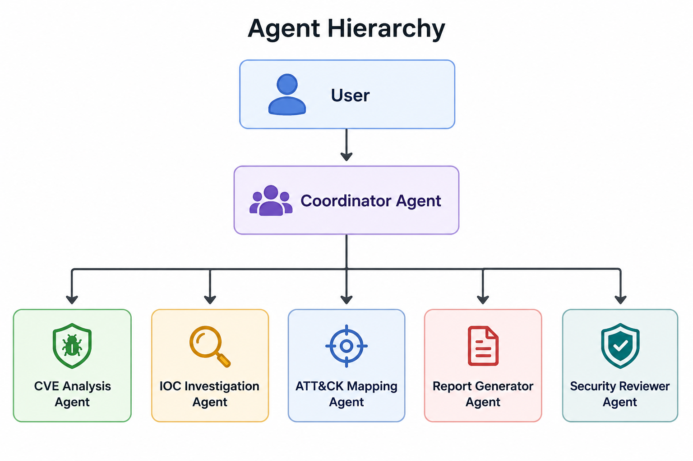
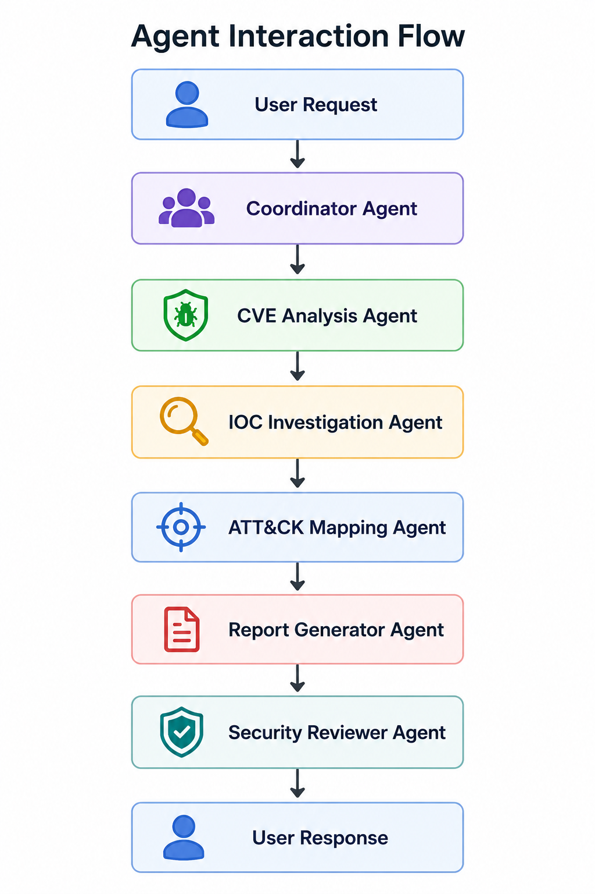

# ThreatMesh Agent Design

## Agent Architecture Overview

ThreatMesh follows a multi-agent architecture where a Coordinator Agent orchestrates specialized cybersecurity agents.

Each agent has a single responsibility and operates with least-privilege access to tools and resources.

### Agent Hierarchy

---

# Coordinator Agent

## Purpose

Serve as the central orchestrator responsible for understanding user requests, selecting appropriate agents, coordinating execution, and aggregating results.

## Responsibilities

* Parse user requests
* Determine investigation type
* Route tasks to specialized agents
* Aggregate findings
* Track workflow progress

## Inputs

* User query
* Investigation parameters

Examples:

* Analyze CVE-2026-1234
* Investigate IP 8.8.8.8
* Generate report for CVE-2026-1234

## Outputs

* Agent execution plan
* Aggregated findings
* Investigation status

## Skills Used

* Workflow Routing Logic

## Tools Access

* Agent Registry
* Workflow Manager

## Security Boundaries

Allowed:

* Invoke specialized agents

Not Allowed:

* Direct access to threat intelligence sources
* Direct report modification

---

# CVE Analysis Agent

## Purpose

Analyze vulnerabilities and provide actionable intelligence.

## Responsibilities

* Retrieve CVE information
* Analyze severity
* Determine exploitability
* Identify affected systems
* Recommend mitigations

## Inputs

* CVE Identifier

Example:

CVE-2026-1234

## Outputs

* CVSS Score
* Severity
* Description
* Exploitability Assessment
* Mitigation Recommendations

## Skills Used

* CVE Analysis Skill

## Tools Access

* NVD MCP Resources
* CISA KEV MCP Resources

## Security Boundaries

Allowed:

* Vulnerability analysis

Not Allowed:

* IOC investigations
* Report publishing

---

# IOC Investigation Agent

## Purpose

Investigate indicators of compromise and assess risk.

## Responsibilities

* Analyze IP addresses
* Analyze domains
* Analyze URLs
* Analyze hashes
* Generate risk assessments

## Inputs

* IP Address
* Domain
* URL
* Hash

## Outputs

* IOC Assessment
* Risk Score
* Investigation Notes
* Recommended Actions

## Skills Used

* IOC Lookup Skill

## Tools Access

* Threat Intelligence MCP

## Security Boundaries

Allowed:

* IOC enrichment

Not Allowed:

* CVE analysis
* Report publishing

---

# ATT&CK Mapping Agent

## Purpose

Map findings to MITRE ATT&CK techniques and tactics.

## Responsibilities

* Identify tactics
* Identify techniques
* Provide ATT&CK references
* Explain adversary behavior

## Inputs

* CVE Findings
* IOC Findings

## Outputs

* ATT&CK Tactics
* ATT&CK Techniques
* Mapping Explanation

## Skills Used

* ATT&CK Mapping Skill

## Tools Access

* MITRE ATT&CK MCP Resources

## Security Boundaries

Allowed:

* ATT&CK mappings

Not Allowed:

* Threat feed modification
* Report publishing

---

# Report Generator Agent

## Purpose

Transform investigation findings into actionable reports.

## Responsibilities

* Generate executive reports
* Generate technical reports
* Summarize findings
* Provide recommendations

## Inputs

* CVE Analysis
* IOC Analysis
* ATT&CK Mapping

## Outputs

### Executive Report

High-level summary for management.

### Technical Report

Detailed findings for analysts.

## Skills Used

* Report Generation Skill

## Tools Access

* Report Templates

## Security Boundaries

Allowed:

* Report generation

Not Allowed:

* Threat intelligence retrieval

---

# Security Reviewer Agent

## Purpose

Validate investigation outputs before final delivery.

## Responsibilities

* Validate references
* Check report completeness
* Detect hallucinations
* Verify source attribution
* Enforce security policies

## Inputs

* Generated reports
* Investigation findings

## Outputs

* Validation Results
* Security Review Report
* Approval Status

## Skills Used

* Validation Logic

## Tools Access

* Validation Engine
* Audit Logs

## Security Boundaries

Allowed:

* Review outputs

Not Allowed:

* Modify original threat intelligence data

---

# Agent Interaction Flow

---

# Agent Security Boundaries

## Principle of Least Privilege

Each agent receives access only to the tools required for its responsibilities.

## Tool Isolation

Agents cannot access tools outside their designated scope.

## Auditability

All agent actions are logged.

## Human Oversight

Critical reports may require user approval before export.

## Validation

All external data is validated before processing.

---

# Agent Failure Handling

## Agent Timeout

Coordinator retries once before failing gracefully.

## Invalid Input

Input validation layer rejects malformed requests.

## MCP Failure

Fallback error response returned.

## Partial Failure

Available results are returned with warnings.

---

# Future Agent Enhancements

* Malware Analysis Agent
* Threat Actor Profiling Agent
* Campaign Correlation Agent
* Threat Hunting Agent
* Security Control Recommendation Agent